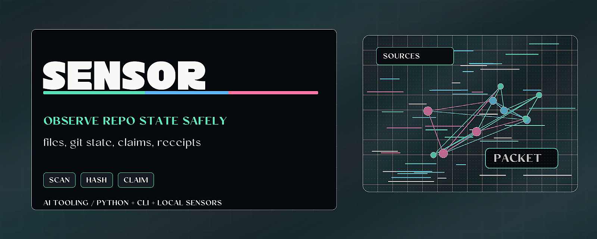

# Provenance Sensorium



> Turn local files, git state, and Markdown claims into inspectable receipts.

Provenance Sensorium reads bounded local project state and emits receipts with
digests, timestamps, confidence notes, and human-review gaps. It is designed for
research and release workflows where an agent should prepare evidence without
pretending to own the final claim.

## Why it matters

Agents need live-state awareness, but awareness is not proof. This tool gives a
repo local sensors that can identify useful evidence, flag secrets, and mark
claims that need human ownership.

## Try it

```powershell
python -m pip install -e .
python -m provenance_sensorium scan fixtures/sample_project
python -m provenance_sensorium receipt fixtures/sample_project --output receipt.json
```

## What to test first

- Scan `fixtures/sample_project`.
- Generate and explain a receipt.
- Run `python scripts/check_public_surface.py` and `python -m pytest`.

## Current status

Product seed with a Python library, CLI, synthetic fixtures, tests, and release
gates. All commands are local-only in v0.1.0.

## Existing technical notes

> Turn files, git state, and Markdown claims into hash-stamped provenance receipts; flag secrets and unevidenced claims before publishing.

[](LICENSE)


[](https://github.com/HarperZ9/provenance-sensorium/actions/workflows/tests.yml)

[](https://harperz9.github.io)

Provenance Sensorium turns local project state into structured observations, passes
those observations through explicit exception layers, and emits receipts that a
human can inspect before making claims, handoffs, publications, or attestations.

It publishes a small, reusable pattern for safer research workflows. Everything in
this repository is public-safe: synthetic fixtures, local-only sensors, and
public abstractions.

## Core Idea

AI systems need better live-state awareness, but awareness is not authority.
Sensorium separates four things:

- **Sensor organs** read bounded local state.
- **Exception layers** classify what the sensors found.
- **Provenance receipts** preserve source, digest, timestamp, and confidence.
- **Human gates** mark claims that require human ownership.
- **Human-gap payloads** let proof-surface consume those gates without treating
  sensor output as human attestation.

The result is a small framework for safer research workflows: the system can
prepare evidence, but it cannot truthfully sign the human part for you.

## Quick Start

```powershell
python -m pip install -e .
python -m pytest
python scripts/check_public_surface.py
python -m provenance_sensorium scan fixtures/sample_project
python -m provenance_sensorium receipt fixtures/sample_project --output receipt.json
python -m provenance_sensorium explain receipt.json
```

## Commands

- `sensorium scan PATH`
- `sensorium receipt PATH --output FILE`
- `sensorium explain RECEIPT`
- `sensorium init-fixture PATH`

All commands are local-only in v0.1.0.

## Usage

See [USAGE.md](USAGE.md) for installation, the full command reference, worked
examples with expected output, and the public Python library surface. A
best-effort end-to-end script lives in [`examples/demo.py`](examples/demo.py).

## Public Boundary

This repository does not contain credentials, client data, private engagement
records, live target tooling, or private research corpus material. It ships
synthetic fixtures and public-safe abstractions.

## Status

v0.1.0 is a product seed: library, CLI, receipts, fixtures, tests, and release
gates. The product direction is live-state awareness for accountable AI research
workflows.

---
**Zain Dana Harper** -- small tools with explicit edges.
[Portfolio](https://harperz9.github.io) · [HarperZ9](https://github.com/HarperZ9)
<sub>Built with Claude Code; reviewed, tested, and owned by me.</sub>

## For developers

Keep the public README, package metadata, and examples aligned with current behavior. Before opening a PR or pushing a release, run the local package verification path.

```bash
python -m pip install -e ".[test]"
python -m pytest
```

See [AGENTS.md](AGENTS.md) for the repo-specific operating boundary and
[CHANGELOG.md](CHANGELOG.md) for current delivery status.
